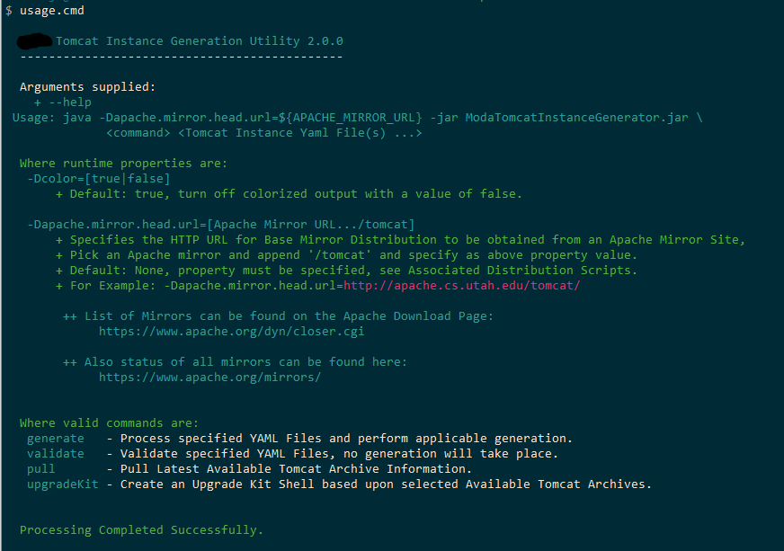

```
  _______                        _     _____           _                        
 |__   __|                      | |   |_   _|         | |                       
    | | ___  _ __ ___   ___ __ _| |_    | |  _ __  ___| |_ __ _ _ __   ___ ___  
    | |/ _ \| '_ ` _ \ / __/ _` | __|   | | | '_ \/ __| __/ _` | '_ \ / __/ _ \ 
    | | (_) | | | | | | (_| (_| | |_   _| |_| | | \__ \ || (_| | | | | (_|  __/ 
   _|_|\___/|_| |_| |_|\___\__,_|\__| |_____|_| |_|___/\__\__,_|_| |_|\___\___| 
  / ____|                         | |                                           
 | |  __  ___ _ __   ___ _ __ __ _| |_ ___  _ __                                
 | | |_ |/ _ \ '_ \ / _ \ '__/ _` | __/ _ \| '__|                               
 | |__| |  __/ | | |  __/ | | (_| | || (_) | |                                  
  \_____|\___|_| |_|\___|_|  \__,_|\__\___/|_|                                  
                                                    
  ___    ___   ___  
 |__ \  / _ \ / _ \ 
    ) || | | | | | |
   / / | | | | | | |
  / /_ | |_| | |_| |
 |____(_)___(_)___/ 
                    
   ```                 												                                                                     

Version 2.0.0
=====================================================================================================================
jeffaschenk@gmail.com

**Tomcat Instance Generator**

  

    Hello, this is the documentation for the  Tomcat Instance Generator. Basically, using constructed 
    YAML configuration file will generate a full Tomcat instance based upon the latest Major.Minor release
    selected.
    
    Please see Examples in this distribution.

    There are two directories underneath the 'examples' distribution:
       examples/bin: contains the scripts to drive generating various Tomcat Configuration and other tools.
      examples/yaml: contains the yaml configuration files which drives the generation process.

   **Requirements**
   Only requirement is that you have an install Jave JRE at least version 8+. The example scripts assume that 'java' is
   on the command path and that the JRE_HOME variable properly set.  Other than that enough disk space to hold a complete
   Apache archive and the resulting generated instances.

   **Errata**
   Minimal validation, but enough to provide a full functional Tomcat Instance.

   Be aware of editing yaml files, these can be very tedious!  Will eventually make a JSON input mapper.  But yaml is used
   by many of the top Operations Infrastructure generation tools such as Chef, Puppet and others.

   **yaml Configurations**
   Some notes on the yaml configurations.

   Current valid 'environmentName's allowed:
            "DEV",
            "STG", "STG2","STG3","STG9",
            "ST", "ST2","ST3","ST9",
            "MO", "MO2","MO3","MO9",
            "PRD"

   All current example yaml confgurations, specify c:\Temp as their respective destination folders, change as needed.


   **RUNNING**

   First, assuming you have Java dialed in and you and in the 'examples/bin' directory,
   perform the 'examples/usage.cmd' for WIN or 'examples/usage.sh' for *nix.  Then take a view of the yaml and then
   run the scripts.

   The output from the usage script, should yield something like this:

   xxxxxx@yyyyyy C:\...\TomcatInstanceGenerator\examples\bin
   $ usage.cmd

      Tomcat Instance Generation Utility 2.0.0
     ---------------------------------------------

    Usage: java -Dapache.mirror.head.url=${APACHE_MIRROR_URL} -jar TomcatInstanceGenerator.jar \
                 <command> <Tomcat Instance Yaml File(s) ...>

     Where runtime properties are:
      -Dcolor=[true|false]
          + Default: true, turn off colorized output with a value of false.

      -Dapache.mirror.head.url=[Apache Mirror URL.../tomcat]
          + Specifies the HTTP URL for Base Mirror Distribution to be obtained from an Apache Mirror Site,
          + Pick an Apache mirror and append '/tomcat' and specify as above property value.
          + Default: None, property must be specified, see Associated Distribution Scripts.
          + For Example: -Dapache.mirror.head.url=http://apache.cs.utah.edu/tomcat/

           ++ List of Mirrors can be found on the Apache Download Page:
                https://www.apache.org/dyn/closer.cgi

           ++ Also status of all mirrors can be found here:
                https://www.apache.org/mirrors/


     Where valid commands are:
      generate   - Process specified YAML Files and perform applicable generation.
      validate   - Validate specified YAML Files, no generation will take place.
      pull       - Pull Latest Available Tomcat Archive Information.
      upgradeKit - Create an Upgrade Kit Shell based upon selected Available Tomcat Archives.


     Processing Completed Successfully.

   xxxxxx@yyyyyy C:\...\TomcatInstanceGenerator\examples\bin
   $
   
   


   Each of the scripts demonstrate the above functions:

   + generate[.cmd|.sh] : Will Generate a MyContainers directory using the examples/yaml/Generate-MyContainers.yaml
                        : It will produce the following Directory hierarchy:
                        
                        xxxxxx@yyyyyy C:\...\MyContainers_1537491742317
                        $ tree
                        Folder PATH listing for volume Windows
                        Volume serial number is 4A4F-0261
                        C:.
                        └───v8.5.34
                            ├───tomcat-base-01
                            │   ├───bin
                            │   ├───conf
                            │   ├───lib
                            │   ├───logs
                            │   ├───webapps
                            │   │   ├───manager
                            │   │   │   ├───images
                            │   │   │   ├───META-INF
                            │   │   │   └───WEB-INF
                            │   │   │       └───jsp
                            │   │   └───ROOT
                            │   │       └───WEB-INF
                            │   └───work
                            ├───tomcat-base-02
                            │   ├───bin
                            │   ├───conf
                            │   ├───lib
                            │   ├───logs
                            │   ├───webapps
                            │   │   ├───manager
                            │   │   │   ├───images
                            │   │   │   ├───META-INF
                            │   │   │   └───WEB-INF
                            │   │   │       └───jsp
                            │   │   └───ROOT
                            │   │       └───WEB-INF
                            │   └───work
                            ├───tomcat-home
                            │   ├───bin
                            │   ├───jre
                            │   ├───lib
                            │   ├───mcatlib
                            │   │   └───sigar-bin
                            │   │       ├───include
                            │   │       └───lib
                            │   └───sbin
                            └───tomcat-mounts
                                ├───appData
                                └───properties

      + generateAll[.cmd|.sh] : Will Generate a several instances of various flavors, these are:
                              : Using the ../yaml/Generate-MyDevEnv.yaml will generate simple Development Environment.
                              : Using the ../yaml/Generate-MyMinimal.yaml will generate a Minimal Environment.
                              : Using the examples/yaml/Generate-STG9.yaml will generate a MyContainers directory
                              : producing an entire new Tomcat  Environment, is this case named STG9.
                              :
                              : In the script you will see the yaml files stack up, this allows for a single download to
                              : be used while generating instances.
                              :
                              : To understand what will be generated, lets peek into the yaml below.  The type of instance
                              : that is generated is based upon the number of distinct series of instance ports defined.
                              : In our example 'STG9', this yaml will generate 8 Tomcat Base instances and a single
                              : home directory. Looking at the yaml:


                              : From the STG9 yaml:
                              :
                              instancePorts:
                              - !!InstancePorts {instanceName: tc01, ajpPort: 8091, debugPort: 9041,
                                                                                                httpPort: 8081, httpsPort: 443, instanceFolder: null, jmxPort: 9001,
                                                                                                mcatRestartAgentPort: 48081, rmi1Port: 9021, rmi2Port: 9031, shutdownPort: 8051,
                                                                                                snmpPort: 9011}
                              - !!InstancePorts {instanceName: tc02, ajpPort: 8092, debugPort: 9042,
                                                                                                httpPort: 8082, httpsPort: 443, instanceFolder: null, jmxPort: 9002,
                                                                                                mcatRestartAgentPort: 48082, rmi1Port: 9022, rmi2Port: 9032, shutdownPort: 8052,
                                                                                                snmpPort: 9012}
                              - !!InstancePorts {instanceName: tc03, ajpPort: 8093, debugPort: 9043,
                                                                                                httpPort: 8083, httpsPort: 443, instanceFolder: null, jmxPort: 9003,
                                                                                                mcatRestartAgentPort: 48083, rmi1Port: 9023, rmi2Port: 9033, shutdownPort: 8053,
                                                                                                snmpPort: 9013}
                              - !!InstancePorts {instanceName: tc04, ajpPort: 8094, debugPort: 9044,
                                                                                                httpPort: 8084, httpsPort: 443, instanceFolder: null, jmxPort: 9004,
                                                                                                mcatRestartAgentPort: 48084, rmi1Port: 9024, rmi2Port: 9034, shutdownPort: 8054,
                                                                                                snmpPort: 9014}
                              - !!InstancePorts {instanceName: tc05, ajpPort: 8095, debugPort: 9045,
                                                                                                httpPort: 8085, httpsPort: 443, instanceFolder: null, jmxPort: 9005,
                                                                                                mcatRestartAgentPort: 48085, rmi1Port: 9025, rmi2Port: 9035, shutdownPort: 8055,
                                                                                                snmpPort: 9015}
                              - !!InstancePorts {instanceName: tc06, ajpPort: 8096, debugPort: 9046,
                                                                                                httpPort: 8086, httpsPort: 443, instanceFolder: null, jmxPort: 9006,
                                                                                                mcatRestartAgentPort: 48086, rmi1Port: 9026, rmi2Port: 9036, shutdownPort: 8056,
                                                                                                snmpPort: 9016}
                              - !!InstancePorts {instanceName: tc07, ajpPort: 8097, debugPort: 9047,
                                                                                                httpPort: 8087, httpsPort: 443, instanceFolder: null, jmxPort: 9007,
                                                                                                mcatRestartAgentPort: 48087, rmi1Port: 9027, rmi2Port: 9037, shutdownPort: 8057,
                                                                                                snmpPort: 9017}
                              - !!InstancePorts {instanceName: tc08, ajpPort: 8098, debugPort: 9048,
                                                                                                httpPort: 8088, httpsPort: 443, instanceFolder: null, jmxPort: 9008,
                                                                                                mcatRestartAgentPort: 48088, rmi1Port: 9028, rmi2Port: 9038, shutdownPort: 8058,
                                                                                                snmpPort: 9018}

                        : Yup, that is a full Tomcat Environment port for port. And can be added up to the extent of not
                        : duplicating ports contained within the yaml configuration, as well as on the existing machine where
                        : this instance will potentially run.


      + pull[.cmd|.sh] : Will simple pull from the Internet what the latest Apache Tomcat Instance are available for
                       : download and used as a designated Tomcat Version to use.
                       : It will produce the following output:

                                  
                       xxxxxx@yyyyyy C:\...\TomcatInstanceGenerator\examples\bin
                       $ pull.cmd

                          Tomcat Instance Generation Utility 2.0.0
                         ---------------------------------------------

                         Using URL: http://apache.cs.utah.edu/tomcat Obtained Response Code: 200

                         Currently Available Archives from Apache Mirror: http://apache.cs.utah.edu/tomcat

                         Version  Name                                  Size in Bytes
                         -------  ------------------------------------- -------------
                         8.5.34   apache-tomcat-8.5.34.zip                   10216736
                         9.0.12   apache-tomcat-9.0.12.zip                   10520486

                         Processing Completed Successfully.

                       xxxxxx@yyyyyy C:\...\TomcatInstanceGenerator\examples\bin
                       $

      + upgradeKit[.cmd|.sh] : Will produce an upgrade kit that will allow an upgrade of an existing Tomcat instance
                             : to a new version within the same line.  Currently only 8.5.xx line is supported.
                             : Running the script will pull the current available archives and prompt the user for which
                             : version to use to produce an upgrade kit for.
                             :
                             : Just a note, there is only a bash shell script that is created for performing the upgrade,
                             : as it is assumed the destination Tmcat Instance to be upgraded resides on a linux os.


                             xxxxxx@yyyyyy C:\...\TomcatInstanceGenerator\examples\bin
                             $ upgradeKit.cmd

                                Tomcat Instance Generation Utility 2.0.0
                               ---------------------------------------------

                               Using URL: http://apache.cs.utah.edu/tomcat Obtained Response Code: 200

                               Currently Available Archives from Apache Mirror: http://apache.cs.utah.edu/tomcat

                               Version  Name                                  Size in Bytes
                               -------  ------------------------------------- -------------
                               8.5.34   apache-tomcat-8.5.34.zip                   10216736
                               9.0.12   apache-tomcat-9.0.12.zip                   10520486

                              Select Version to build Upgrade Shell: 8.5.34  <-- Prompted for Version to Use.

                               Tomcat Version Selected: 8.5.34, Starting Upgrade Kit Shell Creation ...

                               Using Work Destination Folder: C:\Users\schenkje\AppData\Local\Temp\v8.5.34_UPGRADE_KIT_1538100074812

                               Pulling Tomcat Version from Apache Mirror ...
                                Using URL for Downloading Artifact: http://apache.cs.utah.edu/tomcat/tomcat-8/v8.5.34/bin/apache-tomcat-8.5.34.zip

                               Validating Tomcat Version Archive ...

                               Validated Downloaded Archive: ....\AppData\Local\Temp\v8.5.34_UPGRADE_KIT_1538100074812\apache-tomcat-8.5.34.zip, Completed ...

                                  + File Size: '10216736', Correct.   Computed CheckSum:'149d7050df86bb31d9764cdc8d2e73a35bd5543d'.

                               Exploding Tomcat Version Archive for Customizations ...

                               Successfully Exploded Instance to Folder: apache-tomcat-8.5.34

                               Processing Completed Successfully.

                             xxxxxx@yyyyyy C:\...\TomcatInstanceGenerator\examples\bin


                             : The folder structure produce for example will be:


                             ...\AppData\Local\Temp\v8.5.34_UPGRADE_KIT_1538100074812
                             $ tree
                             Folder PATH listing for volume Windows
                             Volume serial number is 4A4F-0261
                             C:.
                             └───v8.5.34
                                 ├───tomcat-base-0x
                                 │   ├───bin
                                 │   ├───conf
                                 │   ├───lib
                                 │   ├───logs
                                 │   ├───webapps
                                 │   │   ├───manager
                                 │   │   │   ├───images
                                 │   │   │   ├───META-INF
                                 │   │   │   └───WEB-INF
                                 │   │   │       └───jsp
                                 │   │   └───ROOT
                                 │   │       └───WEB-INF
                                 │   └───work
                                 ├───tomcat-home
                                 |   ├───bin
                                 |   ├───jre
                                 |   ├───lib
                                 |   └───sbin
                                 tc_upgrade_to_v8.5.xx.sh

                             xxxxxx@yyyyyy C:\...\v8.5.34_UPGRADE_KIT_1538100074812
                             $

                             : You will also have the complete Apache Tomcat archive available, which was downloaded
                             and used as a base to construct the upgrade kit.

                             
      + usage[.cmd|.sh] : Produce the Usage Help view.

      + usageNOCOLOR[.cmd|.sh] : For those who dislike the color output and for robots.

      + validate[.cmd|.sh] : Will validate your yaml to ensure ports are not duplicated and that an instance could be generated.


   **A word on apache Mirror Download Sites**
   Recovery capability has been added to detect when an improper download length has
   been obtained from the mirror site.  Yes, this can occur.  These apache mirror sites are providing WEBDav/FTP access
   to a number of Apache Open-Source products, not just Tomcat.

   This frequently happens when attaching to Mirrored Servers, as they can be servicing many requests from all over the world.
   If it occurs more often then not, simply change to a different mirror.  You can set a property for that.
   For Example: set property name: 'apache.mirror.head.url' to a value mirror prior to executing the Jar.

       java -Dapache.mirror.head.url=http://apache.cs.utah.edu/tomcat -jar ...

   List of Mirrors can be found on the apache Download Page:
       https://www.apache.org/dyn/closer.cgi

   Pick an Apache mirror and append the .../tomcat and give it a whirl...

   Also status of all mirrors can be found here:
   https://www.apache.org/mirrors/

           
